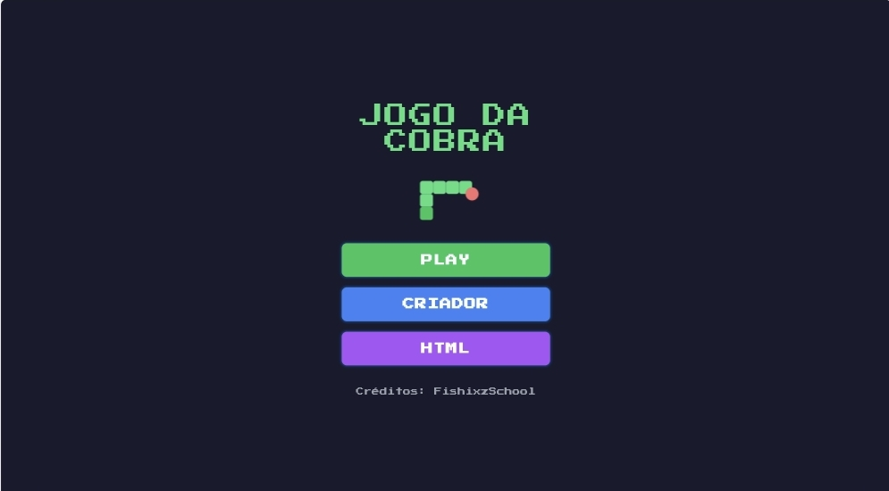

# 🐍 Jogo da Cobrinha (Snake Game)

Este é um simples jogo da cobrinha (Snake) desenvolvido com **HTML, CSS e JavaScript puro**. O objetivo é controlar a cobra, coletar a comida e evitar bater nas paredes ou em si mesma.

## 🚀 Funcionalidades

- ✅ Movimento com setas do teclado
- ✅ Pontuação dinâmica
- ✅ Game Over ao colidir com a parede ou a própria cobra
- ✅ Código simples e limpo para estudos

## 🎮 Como jogar

- Use as **setas do teclado** (↑ ↓ ← →) para mover a cobrinha.
- Coma a comida para crescer e aumentar sua pontuação.
- Evite bater nas bordas ou em si mesma!

## 📸 Preview

## 🌐 Teste agora

👉 [Clique aqui para jogar online](https://fishixzschool.github.io/websites/Jogos/Jogo%20da%20Cobra/)

## 🛠 Tecnologias

- HTML
- CSS
- JavaScript

## 📄 Licença

Este projeto está sob a licença MIT. Sinta-se livre para usar, modificar e compartilhar!

---

Feito com ❤️ por [! Edy](https://github.com/fishixzschool)
