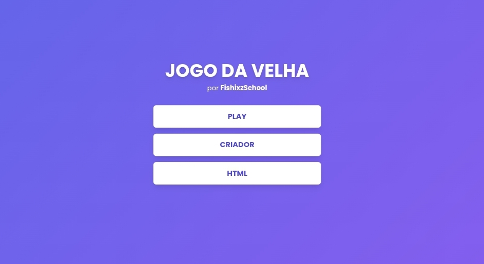
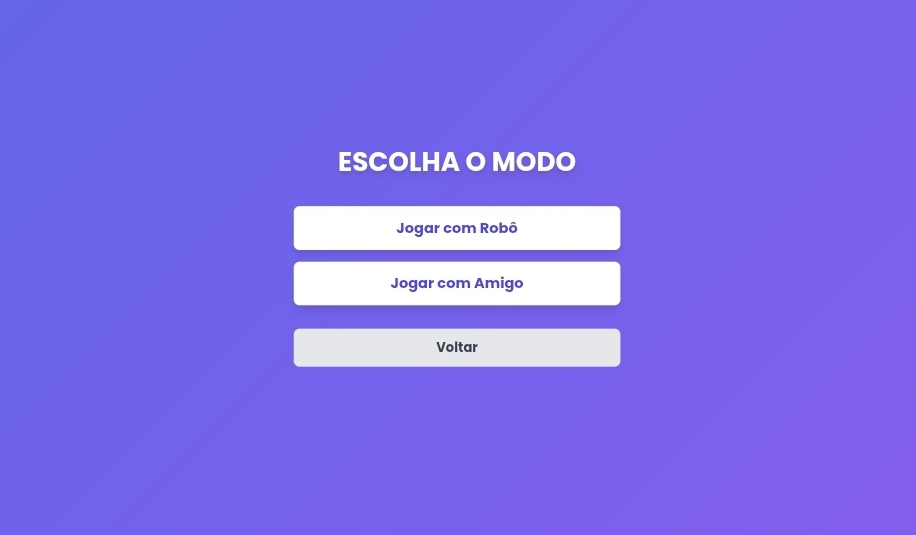
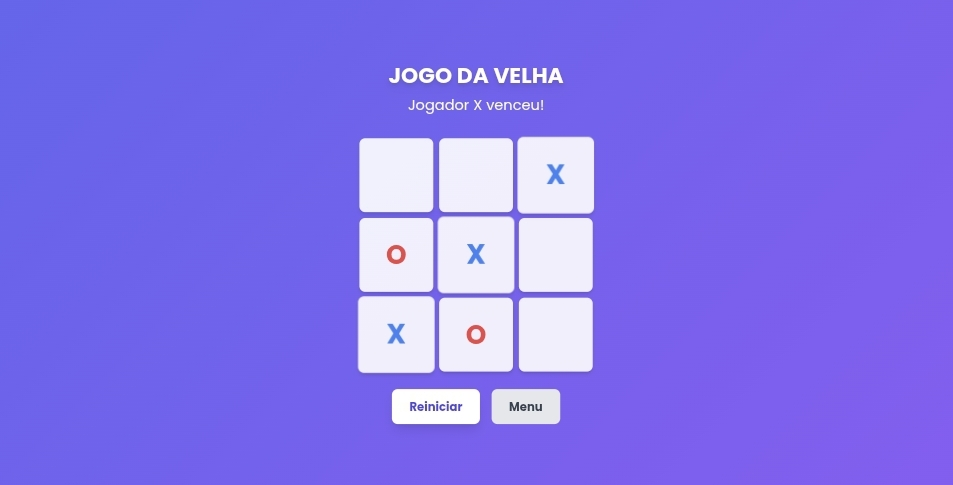

# ❌🟢 Jogo da Velha (Tic Tac Toe)

Um jogo clássico do **Jogo da Velha** feito com HTML, CSS e JavaScript. Você pode jogar contra um amigo ou contra uma **IA inteligente** diretamente pelo navegador.

## 🎮 Modos de Jogo

- 🤖 **Jogar com Robô:** Enfrente uma inteligência artificial que toma decisões automaticamente.
- 👥 **Jogar com Amigo:** Dois jogadores se alternam na mesma tela usando o mouse.

## 🚀 Funcionalidades

- ✅ Interface simples e intuitiva
- ✅ Alternância automática de turnos
- ✅ Detecção de vitória ou empate
- ✅ Reinício rápido da partida
- ✅ IA com lógica para dificultar a vitória

## 📸 Preview

## 🌐 Teste agora

👉 [Clique aqui para jogar online](https://fishixzschool.github.io/websites/Jogos/Jogo%20da%20Velha/)

## 🛠 Tecnologias

- HTML
- CSS
- JavaScript (puro, sem bibliotecas externas)

## 📄 Licença

Este projeto está sob a licença MIT. Pode usar, modificar e compartilhar livremente.

---

Feito com ❤️ por [! Edy](https://github.com/fishixzschool)
